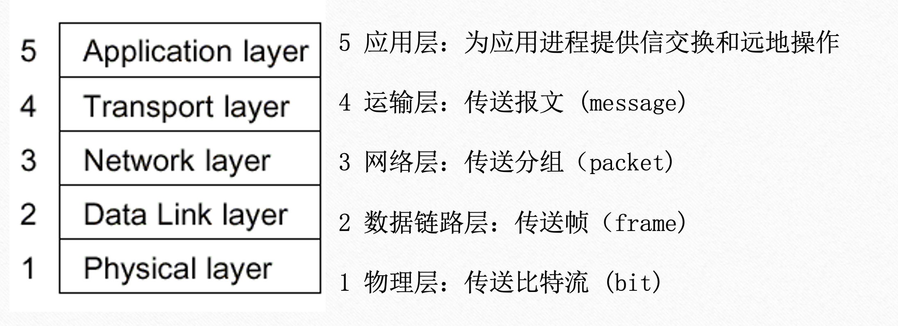

+++
date = '2025-11-20T12:01:45+08:00'
draft = false
math = true
title = '计算机网络按层复习'
summary = "按网络层次（物理/链路/网络/传输/应用）整理的计算机网络复习笔记，包含常见物理层线路编码与调制简介。"
+++

# 按层整理的计算机网络复习笔记

本文按网络分层（物理层、链路层、网络层、传输层、应用层）整理要点，并在物理层补充常见线路编码与带通调制的简介，便于复习与查阅。

---

## 体系结构与参考模型

+ **OSI 七层模型** vs **TCP/IP 五层模型**
  

+ **TCP/IP 五层模型各层传输单元**
  

---

## 物理层（Physical Layer） — 编码与调制

### 采样与信道极限
 - **采样定理**：采样频率 $f_s > 2 f_{max}$。
 - **奈奎斯特（无噪声）**：最大速率 $$C_{max} = 2W\\log_2 V\\quad(\\text{bps})$$。
 - **香农（有噪声）**：信道容量 $$C = W\\log_2(1+S/N)\\quad(\\text{bps})$$。

### 线路编码详解（基带传输）

#### 1. 不归零编码 (NRZ - Non-Return to Zero)
*   **NRZ-L (Level)**：高电平代表 1，低电平代表 0。
*   **NRZI (Inverted)**：电平翻转代表 1，电平保持代表 0。
*   **缺点**：存在直流分量；缺乏同步能力（连续的 0 或 1 会导致时钟漂移）。

#### 2. 曼彻斯特编码 (Manchester Encoding)
*   **原理**：将每个比特周期分为两半，**在周期中间进行电平跳变**。
    *   **跳变即时钟**：中间的跳变既作为数据信号，也作为时钟信号（Self-clocking）。
    *   **编码规则** (IEEE 802.3 标准)：
        *   **1**：从低电平跳变到高电平 ($\uparrow$)。
        *   **0**：从高电平跳变到低电平 ($\downarrow$)。
        *   *(注：G.E. Thomas 标准与之相反)*
*   **优点**：
    *   **自带时钟同步**：接收端容易提取时钟信号。
    *   **无直流分量**：正负电平相互抵消。
*   **缺点**：
    *   **频带利用率低**：信号频率是数据率的 2 倍（因为每个比特至少跳变一次），需要双倍带宽。
*   **应用**：10BASE-T 以太网。

#### 3. 差分曼彻斯特编码 (Differential Manchester)
*   **原理**：
    *   **周期中间**：始终有跳变（用于时钟同步）。
    *   **位开始处**：
        *   **有跳变** $\rightarrow$ 表示 **0**。
        *   **无跳变** $\rightarrow$ 表示 **1**。
*   **优点**：
    *   继承了曼彻斯特编码的优点（自同步、无直流）。
    *   **抗干扰性更强**：利用电平跳变的相对关系而非绝对极性来表示数据，对噪声更不敏感。
*   **应用**：令牌环网 (Token Ring)。

#### 4. AMI (Alternate Mark Inversion)
*   **规则**：**0** 为零电平；**1** 为正负电平交替（例如：+V, -V, +V...）。
*   **特点**：无直流分量，但连续的 0 仍可能导致同步丢失（需配合扰码技术如 HDB3）。

### 线码与块编码（用于时钟、直流平衡与效率提升）
 - **4B/5B**：将 4 比特映射为 5 比特代码（保证足够的转换以恢复时钟），常与 MLT-3 配合用于 100BASE-TX。
 - **MLT-3**：多电平传输（多用于 100BASE-TX），电平序列循环以降低频谱带宽。

### 带通调制（用于无线与宽带链路）
 - **ASK (Amplitude Shift Keying)**：振幅改变表示比特。
 - **FSK (Frequency Shift Keying)**：频率改变表示比特（例如蓝牙早期使用 FSK）。
 - **PSK (Phase Shift Keying)**：相位改变表示比特；QPSK 用两个比特/符号。
 - **QAM (Quadrature Amplitude Modulation)**：幅度与相位联合，用于高阶星座（例如 16-QAM、64-QAM），提高频谱效率。

### 实用注记
 - 10BASE-T 使用 Manchester；100BASE-TX 使用 4B/5B + MLT-3；千兆与更高速以太网使用更复杂的 PAM 与多电平方案。

---

## 链路层（Data Link Layer） — MAC、帧结构与差错检测

 - 以太网帧：前导码 + 目的/源 MAC + 类型/长度 + 数据 + CRC；最小载荷 46B（不足填充）。
 - 差错检测：CRC（循环冗余校验）。
 - 地址解析：ARP 将 IP 映射为 MAC。

### ARP 地址解析协议 (Address Resolution Protocol)
ARP 解决了**已知 IP 地址，求 MAC 地址**的问题，是实现链路层传输的关键。

#### 1. 工作流程
1.  **查表**：主机 A 想发数据给主机 B (IP_B)，先查本地 **ARP 缓存表**。若命中，直接使用。
2.  **广播请求**：若未命中，A 广播发送 **ARP Request**（目的 MAC 为 `FF-FF-FF-FF-FF-FF`），询问：“谁是 IP_B？请告诉我你的 MAC。”
3.  **单播响应**：本局域网内所有主机收到请求，只有 B 识别出是找自己，于是**单播**发送 **ARP Reply** 给 A：“我是 IP_B，我的 MAC 是 MAC_B。”
4.  **更新缓存**：A 收到后，将 (IP_B, MAC_B) 写入 ARP 缓存，并发送数据帧。

#### 2. 什么时候用到 ARP？
只要涉及到**封装 MAC 帧**，就需要用到 ARP。具体分为两种情况：
*   **同一局域网内通信**：
    - 源主机判断目的 IP 在同一网段。
    - 直接请求**目的主机 IP** 对应的 MAC 地址。
*   **跨网段通信（访问互联网）**：
    - 源主机判断目的 IP 不在同一网段。
    - 源主机需要将包发给**默认网关（路由器）**。
    - 此时，源主机请求的是**网关 IP** 对应的 MAC 地址（而不是最终目的主机的 MAC）。
    - *注意*：MAC 地址只在一段链路（Hop-to-Hop）内有效，每经过一个路由器，源/目 MAC 都会改变。

#### 3. 免费 ARP (Gratuitous ARP)
主机启动或 IP 变更时，主动广播关于自己的 ARP 请求。用于：
- **检测 IP 冲突**：若收到回复，说明 IP 被占用。
- **更新邻居缓存**：告知其他主机自己 MAC 变了（如双机热备切换）。

### 多址访问（MAC）
 - **信道划分**：TDMA / FDMA / CDMA（重负载场景）。
 - **随机访问**：纯 ALOHA、时隙 ALOHA、CSMA、CSMA/CD（有线）、CSMA/CA（无线）。
 - **轮流方法**：轮询、令牌环（Token Ring）。

#### CSMA 的三种监听策略
CSMA 的核心是“先听后发”，根据监听结果的不同处理方式，分为：
1.  **1-坚持 (1-persistent)**：
    - 若信道空闲，**立即发送** (概率 1)。
    - 若信道忙，**持续监听**，直到空闲立即发送。
    - *缺点*：若两个站点同时监听到变为空闲，立即发送会导致冲突。
2.  **非坚持 (Non-persistent)**：
    - 若信道空闲，立即发送。
    - 若信道忙，**放弃监听**，等待一个随机时间后再来监听。
    - *优点*：减少冲突；*缺点*：信道利用率低（可能信道空闲了但大家都在等）。
3.  **p-坚持 (p-persistent)**：
    - 若信道空闲，以**概率 p 发送**，概率 1-p 推迟到下一个时隙。
    - 若信道忙，持续监听（类似 1-坚持）。
    - *平衡*：在冲突概率和信道利用率之间折中。

### CSMA/CD (Carrier Sense Multiple Access with Collision Detection)
*用于有线以太网（半双工）*
 - **核心机制**：
   1. **先听后发 (Carrier Sense)**：发送前监听信道，空闲则发送，忙则等待。
   2. **边发边听 (Collision Detection)**：发送过程中持续监听信道电平。
   3. **冲突停止**：一旦检测到冲突（电平叠加），立即停止发送数据，并发送**人为干扰信号 (Jamming Signal)** 强化冲突，通知所有站点。
   4. **随机重发**：执行二进制指数退避算法，等待一段时间后重试。
 - **关键参数**：
   - **争用期 (Contention Period)**：$2\tau$ (两倍端到端传播时延)。
   - **最小帧长**：$L_{min} = 2\tau \times R$。必须保证在发送完一帧之前，信号能跑个来回，确保能检测到最远端的冲突。
 - **二进制指数退避算法 (Truncated Binary Exponential Backoff)**：
   - **目的**：动态适应网络负载。冲突次数越多，说明网络负载越重，需要等待更长时间以减少再次冲突的概率。
   - **算法流程**：
     1. 确定基本退避时间，一般为争用期 $2\tau$。
     2. 定义重传次数 $k$，且 $k = \min(\text{重传次数}, 10)$（截断机制，超过 10 次后范围不再扩大）。
     3. 从整数集合 $[0, 1, \dots, 2^k - 1]$ 中随机取出一个数 $r$。
     4. 重传所需的退避时间为 $r \times 2\tau$。
     5. 当重传达 16 次仍不能成功时，丢弃该帧并向高层报错。
   - **举例**：
     - 第 1 次冲突：$k=1$，范围 $\{0, 1\}$，等待 $0$ 或 $2\tau$。
     - 第 2 次冲突：$k=2$，范围 $\{0, 1, 2, 3\}$，最大等待 $6\tau$。
     - ...
     - 第 10 次冲突：$k=10$，范围 $\{0, \dots, 1023\}$。
 - **效率**：近似公式 $$\text{Efficiency} = \frac{1}{1+5t_{prop}/t_{trans}}$$。

### CSMA/CA (Carrier Sense Multiple Access with Collision Avoidance)
*用于无线局域网 (IEEE 802.11)*
 - **为什么不用 CD？**
   1. **检测困难**：无线信号衰减剧烈，发送方本地信号强度远大于接收到的远端信号，难以在发送时检测到冲突。
   2. **隐蔽站问题 (Hidden Terminal)**：A 和 C 都想发给 B，但 A 听不到 C，导致 A 以为信道空闲而发送，在 B 处发生冲突。
 - **核心机制 (MACA 思想)**：
   1. **帧间间隔 (IFS)**：发送前必须等待一段空闲时间（DIFS/SIFS 等），优先级高的帧等待时间短。
   2. **随机退避**：即使信道空闲，也先退避一段随机时间，避免多个站点同时检测到空闲而冲突。
   3. **链路层确认 (ACK)**：接收方收到数据后回复 ACK。若发送方未收到 ACK，则重传。
   4. **RTS/CTS (可选，解决隐蔽站)**：
      - **RTS (Request To Send)**：发送方广播“我要发数据，需占用时间 T”。
      - **CTS (Clear To Send)**：接收方广播“允许发送，需占用时间 T”。
      - **NAV (Network Allocation Vector)**：周围站点收到 RTS 或 CTS 后，在时间 T 内保持静默（虚拟载波监听）。

### 信道利用率 (Channel Utilization)
 - **定义**：发送方处于发送数据状态的时间占总时间的比例。
 - **停等协议 (Stop-and-Wait)**：
   - 发送一帧的时间：$T_{frame} = L/R$。
   - 往返时间：$RTT$。
   - 利用率公式：
     $$ U = \frac{T_{frame}}{T_{frame} + RTT} = \frac{1}{1 + 2a} $$
     其中 $a = \frac{T_{prop}}{T_{frame}}$ (传播时延 / 发送时延)。
 - **滑动窗口协议 (Sliding Window)**：
   - 设窗口大小为 $N$。
   - 若 $N \times T_{frame} < T_{frame} + RTT$，则 $U = \frac{N \times T_{frame}}{T_{frame} + RTT}$。
   - 若 $N \times T_{frame} \ge T_{frame} + RTT$，则 $U = 1$ (信道被填满)。

### 局域网互连与交换机转发
局域网内的通信主要依靠**以太网交换机 (Switch)**，它工作在链路层。

#### 1. 交换机 vs 集线器 (Hub)
*   **集线器 (Hub)**：物理层设备。收到信号后，简单放大并**广播**到所有其他端口。所有主机共享冲突域，带宽共享。
*   **交换机 (Switch)**：链路层设备。能识别帧的 MAC 地址，**选择性转发**。每个端口是一个独立的冲突域，支持全双工，带宽独享。

#### 2. 交换机工作原理：自学习与转发
交换机维护一张**交换表 (Switch Table)**，记录 `(MAC 地址, 接口, 时间戳)`。
*   **自学习 (Self-learning)**：
    *   当交换机收到一个帧时，记录**源 MAC** 和**入端口**的映射关系。
    *   “原来 MAC A 在接口 1 那边”。
*   **转发与过滤 (Forwarding & Filtering)**：
    *   检查帧的**目的 MAC**。
    *   **已知 (查表命中)**：若目的 MAC 在表中，且对应接口与入接口不同，则**单播**转发到该接口；若相同（在同一网段），则**丢弃**（过滤）。
    *   **未知 (查表未命中)**：向除入端口外的所有端口**泛洪 (Flood)**。
    *   **广播帧**：始终泛洪。

#### 3. 广播域与 VLAN
*   **广播域**：交换机的所有端口属于同一个广播域（广播帧会传遍整个网络）。路由器隔离广播域。
*   **VLAN (Virtual LAN)**：在交换机上逻辑划分广播域。不同 VLAN 间通信需通过路由器。

#### 局域网通信综合示例：H1 发送数据给 H4
基于同网段通信场景（如 H1: `192.168.0.1` -> H4: `192.168.0.4`），结合 **主机 ARP 缓存表** 与 **交换机转发表** 的交互流程。

**1. 预处理：判断网段**
*   H1 用自己的子网掩码与 H4 的 IP 进行“与”运算，发现与自己在同一网段。
*   结论：**直接交付**，目标 MAC 应为 H4 的 MAC。

**2. 情况 A：H1 的 ARP 缓存表中有 H4**
*   **H1 行为**：直接从 ARP 表中查出 H4 的 MAC，封装数据帧（目 MAC = MAC_H4），发送给交换机。
*   **交换机行为**：收到帧后，查找**转发表 (MAC Table)**。
    *   若表中存在 MAC_H4 的记录，则从对应接口**单播**转发。
    *   若表中不存在，则**泛洪**。

**3. 情况 B：H1 的 ARP 缓存表中无 H4**
*   **H1 行为 (ARP 请求)**：
    *   发送 **ARP Request**。
    *   封装：源 MAC = MAC_H1，目 MAC = `FF:FF:FF:FF:FF:FF` (广播)。
*   **交换机行为 (泛洪)**：
    *   收到广播帧，向除入接口外的所有接口转发。
    *   **自学习**：记录 MAC_H1 对应的入接口。
*   **H4 行为 (ARP 响应)**：
    *   收到 ARP 请求，发现问的是自己。
    *   发送 **ARP Reply** (单播)。
    *   封装：源 MAC = MAC_H4，目 MAC = MAC_H1。
*   **交换机行为 (转发)**：
    *   收到单播帧，查找转发表（此时已有 MAC_H1 记录），将帧转发给 H1。
    *   **自学习**：记录 MAC_H4 对应的入接口。
*   **H1 行为 (数据传输)**：
    *   收到 ARP Reply，更新 **ARP 缓存表**。
    *   开始发送真实数据帧（同情况 A）。

---

## 网络层（Network Layer） — IP 与路由

 - **IP**：无连接、不可靠，负责寻址与分片（MTU 限制）。
 - **路由**：静态/动态（RIP、OSPF、BGP 概念）。
 - **子网与掩码**：CIDR 表示法，注意网络/主机位划分。

### IP 地址分类与特殊地址

#### 1. 分类编址 (Classful Addressing)
虽然现在普遍使用 CIDR (无类别域间路由)，但理解分类编址仍是基础。
*   **A 类**：`0` 开头 (1.0.0.0 - 126.0.0.0)，默认掩码 /8。
*   **B 类**：`10` 开头 (128.0.0.0 - 191.255.0.0)，默认掩码 /16。
*   **C 类**：`110` 开头 (192.0.0.0 - 223.255.255.0)，默认掩码 /24。
*   **D 类**：`1110` 开头 (224.0.0.0 - 239.255.255.255)，用于**多播 (Multicast)**。
*   **E 类**：`1111` 开头 (240.0.0.0 - 255.255.255.255)，保留。

#### 2. 特殊 IP 地址
| 地址类型 | IP 地址形式 | 源/目 | 用途 |
| :--- | :--- | :--- | :--- |
| **网络地址** | 主机号全 0 | - | 标识一个网络，不可分配给主机。 |
| **直接广播** | 主机号全 1 | 目 | 在特定网络内广播（例如 192.168.1.255）。 |
| **受限广播** | 255.255.255.255 | 目 | 在**本网络**内广播，路由器不转发。 |
| **本主机** | 0.0.0.0 | 源 | DHCP 启动时标识本机；路由表中表示默认路由。 |
| **环回地址** | 127.x.x.x | 源/目 | 环回测试 (Loopback)，数据不离开本机。常见 127.0.0.1。 |

#### 3. 私有地址 (Private IP)
用于局域网内部，不可在公网路由（需 NAT 转换）。
*   **A 类私有**：`10.0.0.0/8` (10.0.0.0 - 10.255.255.255)
*   **B 类私有**：`172.16.0.0/12` (172.16.0.0 - 172.31.255.255)
*   **C 类私有**：`192.168.0.0/16` (192.168.0.0 - 192.168.255.255)

### IP 分组转发流程
当路由器收到一个 IP 数据报时，处理流程如下：
1.  **提取目的 IP 地址** ($D$)。
2.  **判断是否直接交付**：
    - 检查 $D$ 是否与路由器某个接口在同一个子网（通过子网掩码计算）。
    - 若是，则通过 ARP 获取目的主机的 MAC 地址，将数据报封装成帧，**直接交付**给目的主机。
3.  **查找路由表（间接交付）**：
    - 若不是直接交付，则在路由表中查找 $D$。
    - **最长前缀匹配 (Longest Prefix Match)**：若路由表中有多个条目匹配 $D$，选择掩码最长（最具体）的那个条目。
    - 路由表条目通常包含：`(目的网络, 子网掩码, 下一跳 IP, 接口)`。
4.  **转发**：
    - 找到下一跳 IP ($N$) 后，通过 ARP 获取 $N$ 的 MAC 地址。
    - **TTL 减 1**：若 TTL 变为 0，丢弃包并发送 ICMP 超时报文。
    - **重新封装 MAC 帧**：源 MAC 变为路由器出接口 MAC，目的 MAC 变为下一跳路由器 MAC。
    - 将帧发送出去。
5.  **默认路由**：若路由表中找不到匹配项，且存在默认路由 (`0.0.0.0/0`)，则转发给默认网关；否则丢弃并发送 ICMP 不可达报文。

#### 跨网段通信示例：IP 与 MAC 的变化
理解跨网段转发，关键在于把握 **IP 地址端到端不变，MAC 地址逐跳改变** 的原则（不考虑 NAT）。

**场景**：主机 A (`192.168.1.2`) 发送数据给主机 B (`192.168.2.2`)。
- **主机 A**：MAC_A，网关 R (`192.168.1.1`, MAC_R1)。
- **路由器 R**：连接网段 1 的接口 MAC_R1，连接网段 2 的接口 MAC_R2。
- **主机 B**：MAC_B。

**过程 1：主机 A -> 路由器 R**
1.  A 发现 B 不在同一网段，查路由表得知需发给网关 R。
2.  A 通过 ARP 获取网关 R 的 MAC 地址 (MAC_R1)。
3.  **封装数据帧**：
    - **源 IP**: `192.168.1.2` (A)
    - **目 IP**: `192.168.2.2` (B)
    - **源 MAC**: `MAC_A`
    - **目 MAC**: `MAC_R1` (网关)

**过程 2：路由器 R -> 主机 B**
1.  R 收到帧，提取 IP 数据报，TTL 减 1。
2.  R 查路由表，发现 B 在直连网段 (`192.168.2.0/24`)。
3.  R 通过 ARP 获取主机 B 的 MAC 地址 (MAC_B)。
4.  **重新封装数据帧**：
    - **源 IP**: `192.168.1.2` (A) —— **保持不变**
    - **目 IP**: `192.168.2.2` (B) —— **保持不变**
    - **源 MAC**: `MAC_R2` (路由器出接口) —— **改变**
    - **目 MAC**: `MAC_B` (下一跳/最终目的) —— **改变**

#### 路由类型与优先级
在路由表中，路由条目通常分为以下几类，匹配优先级从高到低（基于最长前缀匹配原则）：
1.  **主机路由 (Host Route)**：
    - **掩码**：`255.255.255.255` (/32)。
    - **用途**：指向网络中**特定的一台主机**。
    - **优先级**：最高。通常用于特殊管理或安全需求。
2.  **网络路由 (Network Route)**：
    - **掩码**：长度在 1 到 31 之间（如 /24, /16）。
    - **用途**：指向**整个子网**。路由表中大部分条目属于此类。
3.  **默认路由 (Default Route)**：
    - **掩码**：`0.0.0.0` (/0)。
    - **用途**：当目的地址在路由表中找不到任何其他匹配项时使用。
    - **优先级**：最低。

### IP 协议关键字段
 - **TTL (Time To Live)**：生存时间，每经过一个路由器减 1，减至 0 丢弃，防止环路。
 - **Protocol**：上层协议标识（6=TCP, 17=UDP, 1=ICMP）。
 - **Fragment**：标识、标志、片偏移，用于分片重组。

### ICMP (Internet Control Message Protocol)
 - **定义**：网络层协议，用于在 IP 主机、路由器之间传递控制消息。ICMP 报文封装在 IP 数据报中（Protocol 字段为 1）。
 - **功能**：
   1. **差错报告**：当 IP 数据报处理出错时，向源主机发送错误报告。
      - **终点不可达 (Destination Unreachable)**：Type 3。路由器无法转发或主机无法交付（如端口不可达）。
      - **时间超过 (Time Exceeded)**：Type 11。TTL 减为 0（用于 Traceroute）或分片重组超时。
      - **参数问题 (Parameter Problem)**：Type 12。首部字段不正确。
      - **重定向 (Redirect)**：Type 5。告知主机有更好的路由路径。
   2. **网络探测（查询）**：
      - **回送请求/回答 (Echo Request/Reply)**：Type 8 / 0。用于 `ping` 测试连通性。
      - **时间戳请求/回答**：用于时钟同步和测量时间。
 - **应用原理**：
   - **Ping**：发送 ICMP Echo Request，接收 Echo Reply，计算 RTT。
   - **Traceroute (Windows: tracert)**：
     - 发送 UDP（或 ICMP）数据包，TTL 从 1 开始递增。
     - 第 $n$ 个路由器收到 TTL=$n$ 的包，TTL 减为 0，丢弃并回送 **ICMP Time Exceeded**。
     - 源主机收到该 ICMP 报文，记录路由器 IP 和 RTT。
     - 到达目的主机时，端口不可达（UDP）或回送应答（ICMP），结束探测。
 - **注意**：ICMP 差错报文不再产生 ICMP 差错报文（防止无限循环）。

---

## 传输层（Transport Layer） — 可靠性与拥塞控制

### 可靠数据传输（RDT）演进
 - **RDT 1.0**：理想信道。
 - **RDT 2.x**：处理比特误码，引入 ACK/NAK 与序列号。
 - **RDT 3.0**：处理丢包，引入超时重传与定时器。

### 流水线协议
 - **GBN (Go-Back-N)**：接收端单一累积 ACK，超时重传窗口内所有未确认分组。
 - **SR (Selective Repeat)**：接收端可缓存乱序分组，只重传超时分组。

### TCP / UDP
 - **TCP**：面向连接，可靠传输，拥塞控制（慢启动、拥塞避免、快速重传/恢复）、流量控制（滑动窗口）。
 - **UDP**：无连接、无保证，适合实时/简单请求场景（如 DNS、实时媒体）。

### TCP 拥塞控制算法变体
| 算法 | 核心机制 | 特点 |
| :--- | :--- | :--- |
| **TCP Tahoe** | 慢启动 + 拥塞避免 + 快速重传 | 任何丢包（超时或 3 个重复 ACK）都将 `cwnd` 重置为 1，进入慢启动。效率较低。 |
| **TCP Reno** | + **快速恢复** | 收到 3 个重复 ACK 时，执行快速恢复（`cwnd` 减半而非重置为 1），跳过慢启动。 |
| **TCP NewReno** | 改进的快速恢复 | 解决 Reno 在一个窗口内多个包丢失时效率低下的问题。 |
| **TCP CUBIC** | 三次函数增长 | Linux 默认算法。使用三次函数替代线性增长，更适合高带宽延迟积（BDP）网络。 |
| **TCP BBR** | 基于模型 (Model-based) | Google 开发。不基于丢包，而是探测带宽和 RTT，旨在最大化吞吐量并最小化延迟。 |

### TCP 连接管理
 - **三次握手 (建立连接)**：
   1. **SYN** (seq=x)
   2. **SYN+ACK** (seq=y, ack=x+1)
   3. **ACK** (seq=x+1, ack=y+1)
 - **四次挥手 (释放连接)**：
   1. **FIN** (主动关闭方)
   2. **ACK** (被动关闭方)
   3. **FIN** (被动关闭方)
   4. **ACK** (主动关闭方，进入 TIME_WAIT 等待 2MSL)

---

## 应用层（Application Layer） — 协议演进与常见服务

### HTTP
 | 版本 | 连接 | 核心 | 说明 |
 |---:|:---:|:---|:---|
 | HTTP/1.0 | 短连接 | 文本 | 每请求建连接 |
 | HTTP/1.1 | 长连接 | 管线化 | Keep-Alive、管线化（有限应用） |
 | HTTP/2 | 多路复用 | 二进制分帧、HPACK | 降低头部开销、单连接多流 |
 | HTTP/3 | QUIC/UDP | 0-RTT、连接迁移 | 解决 TCP 层面队头阻塞 |

### 邮件与其他服务
 - **SMTP**：发送。
 - **POP3 / IMAP**：接收（POP3 单端，IMAP 多端同步）。
 - **DNS**：域名解析，UDP/TCP 混合使用。

---

## 实验与常用速算（附录）

 - **时延带宽积**：$$\\text{BDP} = \\text{带宽 (bps)} \\times \\text{往返时延 (s)}$$。
 - **16 进制阅读**：2 个 hex 字符 = 1 字节，1 hex 字符 = 4 bit。

---

如需，我可以：
 - 在物理层加入每种编码的示意图或时序图（SVG/PNG）。
 - 将某一层展开为练习题（选择题/计算题）。

您想先把哪部分进一步展开（例如：某些编码的时序图，或 TCP 拥塞控制的流程图）？