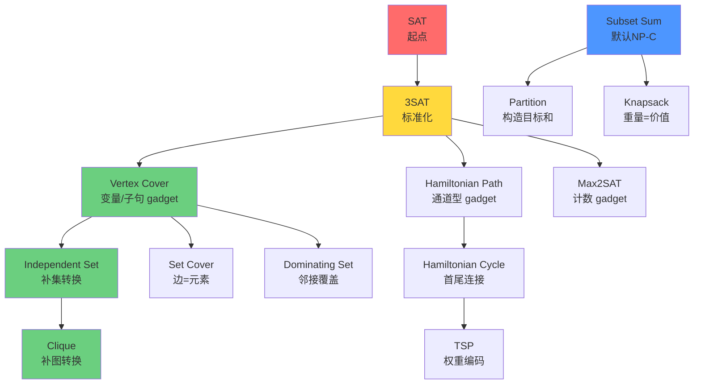

+++
date = '2025-11-26T10:00:00+08:00'
draft = false
math = true
title = '计算理论学习笔记'
summary = "计算理论核心概念复习，涵盖自动机、可计算性与计算复杂性理论。"
tags = ["计算理论", "自动机", "图灵机", "复杂性"]
categories = ["学习笔记"]
+++

# 计算理论导引

> 本笔记涵盖计算理论的三大核心领域：**自动机与语言**、**可计算性理论**和**计算复杂性理论**，系统梳理从有限自动机到图灵机，从可判定性到NP完全性的核心概念与定理。

---

## 1. 自动机与语言 (Automata and Languages)

### 正则语言 (Regular Languages)

#### 有限自动机 (Finite Automata)

> [!NOTE]
> **确定性有限自动机 (DFA)**: $M = (Q, \Sigma, \delta, q_0, F)$
> **非确定性有限自动机 (NFA)**: 允许 $\epsilon$ 转移，同一输入可能有多个转移路径。

**等价性与转化**:
- **NFA $\to$ DFA (子集构造法)**: 
    - DFA 的每个状态对应 NFA 状态的一个子集。
    - 转移函数考虑 $\epsilon$-闭包：
      $$\delta_{DFA}(R, a) = \bigcup_{r \in R} E(\delta_{NFA}(r, a))$$
- **RegEx $\to$ NFA (Thompson 构造法)**: 
    - 模块化构造基础 NFA，利用 $\epsilon$ 转移实现并 ($A \cup B$)、连接 ($AB$) 和星号 ($A^*$) 运算。
- **DFA $\to$ RegEx (状态消除法)**: 
    - 转化为 GNFA 后逐步消除中间状态。
    - 路径更新公式：
      $$R_{new} = R_{old} \cup (R_{in} R_{loop}^* R_{out})$$

#### 正则表达式 (Regular Expressions)
- **定义**: 描述正则语言的代数表示。

#### 封闭性 (Closure Properties)

正则语言在以下运算下**封闭**：
- ✓ 并 (Union)
- ✓ 交 (Intersection)  
- ✓ 补 (Complement)
- ✓ 连接 (Concatenation)
- ✓ 星号 (Kleene Star)

#### Myhill-Nerode 定理
- **用途**: 用于证明语言非正则，或证明 DFA 的最小性。
- **定理**: $L$ 是正则语言 $\\iff$ $L$ 的等价类数目有限。

#### 泵引理 (Pumping Lemma for Regular Languages)

> [!IMPORTANT]
> **用途**: 用于证明某些语言**不是**正则语言 (反证法)。

**定理**: 若 $A$ 是正则语言，则存在泵长度 $p$ (取决于 $A$ 的 DFA 状态数)，使得 $\\forall s \\in A, |s| \\ge p$，可以将 $s$ 分割为 $xyz$，满足：
1. $\\forall i \\ge 0, xy^iz \\in A$ (可以将 $y$ 重复任意次，结果仍在语言中)
2. $|y| > 0$ (中间部分非空)
3. $|xy| \\le p$ (重复部分发生在开头的前 $p$ 个字符内)

**直观理解 (鸽巢原理)**: 
- 设 DFA 有 $p$ 个状态。
- 如果输入字符串 $s$ 的长度 $|s| \ge p$，则处理 $s$ 的前 $p$ 个字符时，DFA 必须经过 $p+1$ 个状态序列 (包含起始状态)。
- 根据鸽巢原理，这 $p+1$ 个状态中至少有两个是相同的。
- 这两个相同状态之间的路径形成了一个环 ($y$)。
- 我们可以遍历这个环任意次 ($y^i$)，最终仍会到达相同的接受状态。

**典型例子**: 证明 $L = \{0^n1^n \mid n \ge 0\}$ 不是正则语言。
1.  **假设** $L$ 是正则语言。
2.  设 $p$ 为泵引理给出的泵长度。
3.  **选择** 字符串 $s = 0^p1^p$。显然 $s \in L$ 且 $|s| = 2p \ge p$。
4.  根据泵引理，存在分割 $s = xyz$，满足 $|xy| \le p$ 和 $|y| > 0$。
5.  由于 $|xy| \le p$，且 $s$ 以 $p$ 个 $0$ 开头，因此 $x$ 和 $y$ 必定完全由 $0$ 组成。即 $y = 0^k$，其中 $1 \le k \le p$。
6.  **泵升**: 取 $i=2$，考虑字符串 $s' = xy^2z = xyyz$。
7.  $s'$ 中 $0$ 的数量为 $p+k$，而 $1$ 的数量仍为 $p$。
8.  因为 $k \ge 1$，所以 $p+k \ne p$。故 $s' \notin L$。
9.  这与泵引理的条件 1 矛盾。
10. **结论**: 假设不成立，$L$ 不是正则语言。

#### 正则语言的可判定性问题 (Decidability Problems for Regular Languages)

正则语言有许多性质都是**可判定的**，这得益于 DFA/NFA 的有限性结构。以下是核心的判定问题及其算法：

##### 1. 接受问题 $A_{DFA}$
- **问题**: 给定 DFA $M$ 和字符串 $w$，判定 $M$ 是否接受 $w$。
- **算法**: 在 $M$ 上直接模拟运行 $w$，检查最终状态是否为接受状态。
- **时间复杂度**: $O(n)$，其中 $n = |w|$。
- **可判定性**: **可判定**。

##### 2. 空性问题 $E_{DFA}$
- **问题**: 给定 DFA $M$，判定 $L(M)$ 是否为空（即 $L(M) = \emptyset$）。
- **算法**: 
    1. 将 DFA 看作有向图，状态为节点，转移为边。
    2. 从起始状态 $q_0$ 开始进行 **DFS/BFS 搜索**。
    3. 如果搜索过程中到达了任何接受状态，则 $L(M) \neq \emptyset$；否则 $L(M) = \emptyset$。
- **时间复杂度**: $O(|Q| + |\delta|)$（图遍历）。
- **可判定性**: **可判定**。

##### 3. 等价性问题 $EQ_{DFA}$
- **问题**: 给定两个 DFA $M_1$ 和 $M_2$，判定 $L(M_1) = L(M_2)$。
- **算法核心思想**: 
    - **对称差构造**: $L(M_1) = L(M_2) \iff (L(M_1) \cap \overline{L(M_2)}) \cup (\overline{L(M_1)} \cap L(M_2)) = \emptyset$
    - 利用正则语言的封闭性（补、交、并），构造识别对称差的 DFA。
    - 然后对该 DFA 运行空性检测。
- **步骤**:
    1. 构造 $M_1'$ 识别 $\overline{L(M_1)}$（状态取补）。
    2. 构造 $M_2'$ 识别 $\overline{L(M_2)}$。
    3. 构造 $M_3$ 识别 $L(M_1) \cap \overline{L(M_2)}$（积自动机）。
    4. 构造 $M_4$ 识别 $\overline{L(M_1)} \cap L(M_2)$。
    5. 构造 $M_5$ 识别 $L(M_3) \cup L(M_4)$。
    6. 对 $M_5$ 执行空性检测。
- **时间复杂度**: $O(|Q_1| \times |Q_2|)$（积自动机构造）。
- **可判定性**: **可判定**。

##### 4. 无限性问题 $INFINITE_{DFA}$
- **问题**: 给定 DFA $M$，判定 $L(M)$ 是否为无限集。
- **算法核心**:
    - **泵引理应用**: 如果 $L(M)$ 无限，则必存在长度在 $[p, 2p)$ 范围内的字符串被接受（其中 $p = |Q|$）。
    - **检测环路**: 在 DFA 的可达接受状态路径中检测是否存在环。
- **步骤**:
    1. 计算所有从 $q_0$ 可达的接受状态。
    2. 对每个可达的接受状态，检查是否存在从 $q_0$ 到该状态的路径，使得路径上有环。
    3. 如果存在这样的环，则 $L(M)$ 无限；否则有限。
- **简化算法**: 检查是否存在长度 $\geq p$ 且 $< 2p$ 的被接受字符串。
- **时间复杂度**: $O(|Q|^2)$。
- **可判定性**: **可判定**。

##### 5. 正则性判定 $REGULAR_{TM}$
- **问题**: 给定图灵机 $M$，判定 $L(M)$ 是否为正则语言。
- **结论**: **不可判定**（由莱斯定理直接得出）。
- **直觉**: 这是关于图灵机识别语言的非平凡性质，根据 Rice 定理，所有这类问题都是不可判定的。

> [!IMPORTANT]
> **关键观察**: 
> - 对于**有限结构**（DFA/NFA），几乎所有自然的判定问题都是可判定的。
> - 但对于**图灵机**识别的语言，判断它是否具有正则性等性质则是不可判定的。
> - 这体现了有限自动机的"可控性"与图灵机的"强大但不可预测性"之间的根本差异。


### 上下文无关语言 (Context-Free Languages)

#### 上下文无关文法 (CFG)
- **定义**: $G = (V, \Sigma, R, S)$
    - 产生式规则形式：$A \to \alpha$，其中 $A \in V, \alpha \in (V \cup \Sigma)^*$.

##### 派生与派生树 (Derivations & Parse Trees)
- **派生 (Derivation)**: 通过反复应用产生式规则，从起始符 $S$ 生成字符串的过程。
- **最左派生 (Leftmost Derivation)**: 在推导的每一步中，总是选择字符串中最左边的非终结符进行替换。
- **最右派生 (Rightmost Derivation)**: 总是替换最右边的非终结符。
- **派生树 (Parse Tree)**: 派生的图形化表示，它忽略了替换的顺序，只关注“谁生成了谁”。

##### 歧义性 (Ambiguity)
- **定义**: 如果一个文法对同一个字符串存在**两棵不同的派生树**（或两个不同的最左/最右派生），则称该文法是**歧义的 (Ambiguous)**。

> [!WARNING]
> **为什么歧义性很糟糕？**  
> 在编译器设计中，派生树决定了程序的语义。例如，在算术表达式中，不同的派生树可能导致不同的运算优先级：
> - 文法: $E \to E + E \mid E \times E \mid \text{id}$
> - 字符串: $a + b \times c$
> - **歧义**: 它可以被解析为 $(a+b) \times c$ 或 $a + (b \times c)$。

- **固有歧义 (Inherently Ambiguous Language)**: 有些语言（如 $\{a^i b^j c^k \mid i=j \text{ 或 } j=k\}$）无论用什么 CFG 描述都是歧义的。
##### 乔姆斯基范式 (CNF)
- **定义**: 产生式规则仅限于以下两种形式：
    1. $A \to BC$ (两个非终结符)
    2. $A \to a$ (一个终结符)
    - (可选) $S \to \epsilon$ (如果语言包含空串，且 $S$ 不出现在规则右侧)。

> [!TIP]
> **为什么要用 CNF？**  
> 1. **二叉树性质**: CNF 生成的派生树始终是二叉树，这使得算法处理（如动态规划）变得极其高效。
> 2. **解析算法**: 它是 **CYK 算法**（在 $O(n^3)$ 时间内判定一个串是否属于该语言）的基础。
> 3. **长度预测**: 对于长度为 $n$ 的字符串，CNF 的派生步数正好是 $2n-1$。

##### 任意 CFG 转化为 CNF 的算法
任何不包含空串（或修正后）的上下文无关语言都可以转化为 CNF，分为四个步骤：

1.  **引入新起始符**: 
    - 添加 $S_0 \to S$，确保原有起始符不出现在产生式的右侧。
2.  **消除 $\epsilon$-产生式**: 
    - 找出所有能推导出空串的变量 $A$ ($A \Rightarrow^* \epsilon$)。
    - 对于每条包含 $A$ 的规则（如 $B \to uAv$），添加一条不含该 $A$ 的规则（如 $B \to uv$）。
3.  **消除单位产生式**: 
    - 找出所有 $A \to B$ 的规则。
    - 如果有 $B \to u$，则直接添加 $A \to u$。重复此过程直至消除所有单纯的非终结符替换。
4.  **转换剩余规则**: 
    - **混合规则**: 对于 $A \to Ba$，改写为 $A \to BU$ 和 $U \to a$。
    - **过长规则**: 对于 $A \to B_1 B_2 \dots B_k$ ($k > 2$)，改写为串联的二元规则：$A \to B_1 C_1, C_1 \to B_2 C_2 \dots$。

#### 下推自动机 (Pushdown Automata, PDA)

> [!NOTE]
> **形式化定义**: $M = (Q, \Sigma, \Gamma, \delta, q_0, F)$
> - $\Gamma$: 栈字母表。
> - PDA $\approx$ 拥有无限容量栈 (LIFO) 的 NFA。

**等价性**: 一个语言是上下文无关的 $\iff$ 它被某个 PDA 识别。

##### 1. CFG $\to$ PDA (自顶向下模拟解析)
- **核心逻辑**: 在 PDA 栈中模拟 CFG 的**最左推导**。栈用于存储尚未匹配的推导符号。
- **PDA 构造**: 
    - 设 CFG 为 $G = (V, \Sigma, R, S)$。构造 PDA $P = (\{q_{start}, q_{loop}, q_{accept}\}, \Sigma, V \cup \Sigma, \delta, q_{start}, \{q_{accept}\})$。
- **转移函数规则**:
    1. **初始化**: $\delta(q_{start}, \epsilon, \epsilon) = \{(q_{loop}, S\$)\}$ (将起始符和结束标志压栈)。
    2. **展开非终结符**: 对于每个产生式 $A \to w \in R$:
       $$\delta(q_{loop}, \epsilon, A) = \{(q_{loop}, w)\}$$
       *(若栈顶是变量，则非确定性地替换为其右部)*。
    3. **匹配终结符**: 对于每个 $a \in \Sigma$:
       $$\delta(q_{loop}, a, a) = \{(q_{loop}, \epsilon)\}$$
       *(若栈顶是终结符且与输入匹配，则弹出并读取输入)*。
    4. **结束**: $\delta(q_{loop}, \epsilon, \$) = \{(q_{accept}, \epsilon)\}$。

##### 2. PDA $\to$ CFG (状态对路径构造)
- **目标**: 定义变量 $A_{pq}$，使其生成所有能让 PDA 从状态 $p$ 开始（栈为空）运行到状态 $q$（栈再次为空）的字符串。
- **构造三部曲**:
    1. **基础规则 (Base Case)**:
       - $\forall p \in Q: A_{pp} \to \epsilon$ (原地不动产生空串)。
    2. **串联规则 (Concatenation)**:
       - $\forall p, q, r \in Q: A_{pq} \to A_{pr} A_{rq}$ (路径可以拆分为经过中间状态 $r$ 的两段)。
    3. **嵌套规则 (Nested Step)**:
       - 如果 $p$ 读取 $a$ 压入 $t$，且 $s$ 读取 $b$ 弹出 $t$ 后到达 $q$：
       $$A_{pq} \to a A_{rs} b$$
       *(这表示栈顶符号 $t$ 的生命周期始于 $p \to r$，终于 $s \to q$)*。

> [!TIP]
> **算法直觉**: 这个转换本质上是将 PDA 的**运行轨迹**映射回文法的**派生树**。PDA 的压栈对应树的生长，弹栈对应树枝的结束。

#### 确定性下推自动机 (DPDA)
- 确定性的 PDA（每一步转移是唯一的，且 $\epsilon$ 转移有限制）。
- **能力差异**: DPDA 识别的语言类（确定性上下文无关语言, DCFL）是 CFL 的真子集 ($DCFL \subsetneq CFL$)。
- 例如：$\{ww^R\}$ 是 CFL 但不是 DCFL；$\{wcw^R\}$ 是 DCFL。
- DPDA 能够被确定性地解析，这对编译器设计很重要。

#### 封闭性 (Closure Properties)

CFL 的封闭性：
- ✓ 并 (Union)
- ✓ 连接 (Concatenation)  
- ✓ 星号 (Kleene Star)
- ✗ 交 (Intersection) - **不封闭**
- ✗ 补 (Complement) - **不封闭**

> [!NOTE]
> CFL 与正则语言的交集仍是 CFL。

#### 泵引理 (Pumping Lemma for CFL)

> [!IMPORTANT]
> **用途**: 用于证明某些语言**不是**上下文无关语言。

**定理**: 若 $A$ 是 CFL，则存在泵长度 $p$，使得 $\\forall s \\in A, |s| \\ge p$，可以将 $s$ 分割为 $uvxyz$，满足：
1. $\\forall i \\ge 0, uv^ixy^iz \\in A$
2. $|vy| > 0$ (即 $v$ 和 $y$ 不全为空)
3. $|vxy| \\le p$

**直观理解**: 
- 考虑生成字符串 $s$ 的派生树 (Parse Tree)。
- 若 $s$ 足够长，树的高度必然很高。
- 如果树的高度超过 $|V|$ (非终结符的数量)，则在最长路径上必然会出现重复的非终结符 $R$。
- 设路径上较底层的 $R$ 生成子串 $x$，较高层的 $R$ 生成子串 $vxy$。
- 我们可以用较高层的子树替换较低层的子树 (泵升)，或者反之 (泵降)，生成的字符串仍由文法生成。

**典型例子**: 证明 $L = \{a^nb^nc^n \mid n \ge 0\}$ 不是 CFL。
1.  **假设** $L$ 是 CFL，设 $p$ 为泵长度。
2.  **选择** $s = a^pb^pc^p \in L$。
3.  根据引理，存在分割 $s = uvxyz$，满足 $|vxy| \le p$ 和 $|vy| > 0$。
4.  **分析情况**: 由于 $|vxy| \le p$，子串 $vxy$ 不可能同时包含 $a, b, c$ 三种字符 (因为 $a$ 区和 $c$ 区中间隔着 $p$ 个 $b$)。
    - 情况 1: $v$ 和 $y$ 只包含一种类型的字符 (例如全 $a$)。泵升后该字符数量增加，其他不变，破坏相等关系。
    - 情况 2: $v$ 和 $y$ 包含两种类型的字符 (例如 $a$ 和 $b$)。泵升后 $a$ 和 $b$ 数量增加，$c$ 不变，破坏相等关系。
5.  无论哪种情况，$uv^2xy^2z \notin L$。
6.  **结论**: $L$ 不是 CFL。

#### 进阶引理
- **奥格登引理 (Ogden's Lemma)**:
    - CFL 泵引理的推广，提供了更强的约束力。
    - **定理**: 若 $A$ 是 CFL，则存在长度 $p$。对于任意 $s \\in A$ 且我们在 $s$ 中标记了至少 $p$ 个位置，则 $s$ 可分割为 $uvxyz$，满足：
        1. $\\forall i \\ge 0, uv^ixy^iz \\in A$
        2. $v$ 和 $y$ 中至少包含一个**标记**位置。
        3. $vxy$ 中最多包含 $p$ 个**标记**位置。
    - **用途**: 用于证明某些即使满足普通泵引理但仍非 CFL 的语言 (例如某些具有特定结构的语言)。
- **交换引理 (Interchange Lemma)**:
    - 另一个用于证明非 CFL 的强力工具，特别是当泵引理失效时。
    - **定理**: 设 $L$ 是 CFL。则存在常数 $c > 0$，使得对于 $L$ 的任意长度为 $n$ 的子集 $S_n \\subseteq L \\cap \\Sigma^n$，若 $|S_n|$ 足够大，则存在 $S_n$ 的子集 $Z \\subseteq S_n$，使得 $Z$ 中的任意两个串 $w_i, w_j$ 都可以分解为 $w_i = x_i y_i z_i, w_j = x_j y_j z_j$，满足：
        1. $|x_i| = |x_j|, |y_i| = |y_j|, |z_i| = |z_j|$
        2. $|y_i| > 0$
        3. 交换中间部分后仍属于 $L$，即 $x_i y_j z_i \\in L$ 且 $x_j y_i z_j \\in L$。

#### CFL 的判定问题与不可判定性 (Decidability Boundary)

虽然 CFL 比正则语言更强大，但这种能力的提升也带来了代价：许多在正则语言中可判定的问题，在 CFL 中变成了**不可判定**的。

| 问题 (Decision Problem) | 是否可判定 | 常用方法 / 备注 |
| :--- | :---: | :--- |
| **$A_{CFG}$ (成员资格)** | **✓ 是** | **CYK 算法**: 基于动态规划，复杂度 $O(n^3)$。 |
| **$E_{CFG}$ (空性)** | **✓ 是** | **标记算法**: 从终结符开始向上标记可达非终结符。 |
| **$ALL_{CFG}$ (通用性)** | **✗ 否** | 判定 $L(G) = \Sigma^*$ 是不可判定的（可通过 TM 接受轨迹规约）。 |
| **$EQ_{CFG}$ (相等性)** | **✗ 否** | 判定两个 CFG 是否生成相同语言是不可判定的。 |

> [!CAUTION]
> **危险的“相等性”**: 
> 能够判定两个 DFA 是否等价（通过最小化等），但**无法判定两个 CFG 是否等价**。这意味着对于复杂的代码语法，没有通用的算法能判断两套文法规则是否完全一致。

#### 经典案例深度探讨: $ww, ww^R$ 与 $\overline{ww}$

通过对比这三个极具代表性的语言，可以深入理解 PDA 的限制与能力：

| 语言 | 是否为 CFL | 核心 Insight (物理直觉) |
| :--- | :---: | :--- |
| **$ww^R$** | **✓ 是** | **栈的 LIFO 特性**: 栈天然支持“后进先出”。当我们把 $w$ 压入栈时，弹出的顺序正好是 $w^R$。非确定性 PDA 可以“猜”中点。 |
| **$ww$** | **✗ 否** | **先进先出的缺失**: 栈无法直接匹配“先进先出”的序列。要匹配第二个 $w$ 的第一个字符，它被压在栈底，无法触达。 |
| **$\overline{ww}$** | **✓ 是** | **非确定性的力量**: 虽然判定相等很难，但在非确定性下“寻找一个错误”很简单。只要存在一个位置 $i$ 使得 $s_i \neq s_{i+n}$，就是非 $ww$。 |

---

##### 1. 为什么 $ww^R$ 是 CFL？
- **PDA 构造**: 
    1. 处于状态 $q_1$ 时，读取字符并压入栈。
    2. **非确定性地**猜测字符串的中点，跳转到状态 $q_2$。
    3. 在 $q_2$ 中，每读取一个字符，就从栈顶弹出一个字符进行对比。
    4. 如果全部匹配且栈正好清空，则接受。
- **Key Insight**: 栈的**局部性 (Locality)**。匹配 $ww^R$ 只需要知道“最近”读到了什么，这与栈的顶端操作完美契合。

##### 2. 为什么 $ww$ 不是 CFL？
- **直观证明**: 考虑 $s = a^p b^p a^p b^p$。泵引理的 $vxy$ 窗口长度为 $p$，它只能跨越 $a^p$ 或 $a^p b^p$ 或 $b^p$ 等局部区域，无法同时改变第一段 $w$ 和第二段 $w$ 中对应的位置而保持它们相同。
- **Key Insight**: **远距离关联 (Long-range correlation)**。栈只能处理嵌套结构的关联（如括号匹配），无法处理平行的跨度关联。

##### 3. 为什么 $\overline{ww}$ (非 $ww$) 竟然是 CFL？
这是一个违反直觉的结论，因为 CFL 在补集运算下不封闭。
- **核心逻辑**: 一个偶数长度字符串 $s \in \overline{ww}$ 当且仅当 $\exists i, j$ 满足 $|i-j| = n$ 且 $s_i \neq s_j$ ($n$ 为半长)。
- **CFG 设计思路**:
    - 一个非 $ww$ 的字符串可以表示为：$A B$ 或 $B A$。
    - 其中 $A$ 是一个形如 $x \dots y$ 的序列，其中第 $k$ 个字符和倒数第 $k$ 个字符... 这种构造比较复杂，更简单的理解是：
    - 它可以转化为检测是否存在 $s_i \neq s_{j}$ 且中间隔了刚好 $n-1$ 个字符。
- **Key Insight**: **非确定性的不对称性**。证明“所有位置都对等”需要全局一致性（PDA 做不到）；但证明“存在一个位置不对”只需要非确定性地选中那个位置并局部验证（PDA 擅长）。

#### 深度讨论：非确定性与语法分析 (Deeper Insights)

在理解 CFG 与 PDA 时，有两个极其关键的理论与工程问题值得讨论：

##### 1. 为什么“非确定性”对 PDA 如此重要？
在**有限自动机**中，$NFA = DFA$。但在**下推自动机**中，$NPDA > DPDA$。
- **原因**: 栈是 LIFO 的。在 NPDA 中，我们可以在不知道后续输入的情况下，“非确定性地”尝试不同的栈操作分支。即便某个分支失败了，栈的状态在其他分支中是独立保留的。
- **直觉**: 想象一个迷宫（PDA 的纸带+栈）。NFA 只是在房间里走，标记过的地方可以记下来；而 PDA 带着一卷无限长的绳子（栈），非确定性允许它在分岔路口同时尝试多条路径，每条路径都有自己的“解绳子”进度。

##### 2. 语法分析器 (Parser) 是如何解决非确定性的？
虽然 NPDA 更有能力，但现代编程语言几乎都设计成 **Deterministic (DCFL)**，以便编译器能快速解析。
- **向前看 (Lookahead)**: 编译器（如 Yacc, Bison）通过查看后续的 1 个或 $k$ 个符号来消除非确定性分支。
- **文法分级**: 
    - **LL(k)**: 自顶向下，从左到右，最左派生。
    - **LR(k)**: 自底向上，从左到右，最右派生（更强大，能处理更多文法）。

### 乔姆斯基谱系 (Chomsky Hierarchy)

> [!NOTE]
> 乔姆斯基谱系将形式语言按生成能力划分为四个层次，每一层对应不同的文法类型和自动机模型。

| 文法类型 | 文法名称 | 产生式规则 | 对应自动机 | 对应语言 |
|:---:|:---|:---|:---|:---|
| **0 型** | 无限制文法 | $\alpha \to \beta$ | 图灵机 (TM) | 递归可枚举 (RE) |
| **1 型** | 上下文有关文法 (CSG) | $\alpha A \beta \to \alpha \gamma \beta$ | 线性有界自动机 (LBA) | 上下文有关 (CSL) |
| **2 型** | 上下文无关文法 (CFG) | $A \to \gamma$ | 下推自动机 (PDA) | 上下文无关 (CFL) |
| **3 型** | 正则文法 | $A \to aB$ 或 $A \to a$ | 有限自动机 (DFA/NFA) | 正则语言 (Regular) |

**包含关系**:
```
Regular ⊊ CFL ⊊ CSL ⊊ RE
```

#### 常见语言分类（典型例子）

理解不同语言类的**典型例子**对于快速判断语言归属至关重要：

| 语言类 | 典型正例（属于该类） | 典型反例（不属于该类但可能属于更高类） |
|:---|:---|:---|
| **正则语言** | • $\{w \mid w$ 包含偶数个0$\}$<br>• $(0+1)^*$<br>• $\{0^n1^m \mid n,m \geq 0\}$<br>• 所有有限语言 | • $\{0^n1^n \mid n \geq 0\}$ (是CFL)<br>• $\{ww \mid w \in \{0,1\}^*\}$ (是CFL) |
| **上下文无关** | • $\{0^n1^n \mid n \geq 0\}$<br>• $\{w \mid w = w^R\}$ (回文)<br>• $\{wcw^R \mid w \in \{0,1\}^*\}$<br>• 正确括号匹配<br>• 算术表达式 | • $\{0^n1^n2^n \mid n \geq 0\}$ (是CSL)<br>• $\{ww \mid w \in \{0,1\}^*\}$ (是CSL)<br>• $\{a^{n^2} \mid n \geq 0\}$ (是CSL) |
| **上下文有关** | • $\{0^n1^n2^n \mid n \geq 0\}$<br>• $\{ww \mid w \in \{0,1\}^*\}$<br>• $\{a^{n^2} \mid n \geq 0\}$ | • 停机问题的补集 (是RE但非递归)<br>• $\overline{A_{TM}}$ (不可识别) |
| **递归可枚举** | • $A_{TM} = \{\langle M,w \rangle \mid M$ 接受 $w\}$<br>• 所有可判定语言<br>• 所有CSL | • $\overline{A_{TM}}$ (不可识别)<br>• 不停机问题的语言 |
| **可判定** | • 所有正则语言<br>• 大部分CSL<br>• $\{G \mid G$ 是CFG且 $L(G) \neq \emptyset\}$ | • $A_{TM}$<br>• $\{G \mid L(G) = \Sigma^*\}$ (G是CFG) |

> [!TIP]
> **快速判断技巧**：
> 1. **计数平衡**（如 $a^n b^n$）→ 上下文无关的标志
> 2. **两层计数**（如 $a^n b^n c^n$）→ 超越CFL
> 3. **完美复制**（如 $ww$）→ 超越CFL
> 4. **有限状态可数的**（如"偶数个0"）→ 正则

#### 判定性问题完整对比表

下表总结了不同语言类上的核心判定问题，是考试和研究的重要参考：

| 判定问题 | 正则 (DFA) | 上下文无关 (CFG) | 递归可枚举 (TM) |
|:---|:---:|:---:|:---:|
| **A (成员资格)**<br>$w \in L(M)$? | ✅ $O(n)$<br>直接模拟 | ✅ $O(n^3)$<br>CYK算法 | ✅ 可识别<br>❌ 不可判定 |
| **E (空性)**<br>$L(M) = \emptyset$? | ✅ $O(\|Q\|)$<br>图可达性 | ✅ $O(\|V\|)$<br>标记算法 | ❌ 不可判定<br>(规约自$A_{TM}$) |
| **EQ (等价性)**<br>$L(M_1) = L(M_2)$? | ✅ $O(\|Q_1\| \cdot \|Q_2\|)$<br>对称差+空性 | ❌ 不可判定<br>(经典结论) | ❌ 不可判定<br>(莱斯定理) |
| **ALL (全集)**<br>$L(M) = \Sigma^*$? | ✅ $O(\|Q\|)$<br>补+空性 | ❌ 不可判定<br>(规约自PCP) | ❌ 不可判定<br>(莱斯定理) |
| **FINITE (有限性)**<br>$\|L(M)\| < \infty$? | ✅ $O(\|Q\|^2)$<br>环检测+泵引理 | ✅ $O(\|V\|^2)$<br>自相关性检测 | ❌ 不可判定<br>(莱斯定理) |
| **INFINITE (无限性)**<br>$\|L(M)\| = \infty$? | ✅ $O(\|Q\|^2)$<br>见上 | ✅ $O(\|V\|^2)$<br>见上 | ❌ 不可判定<br>(莱斯定理) |
| **REG (正则性)**<br>$L(M)$ 是正则? | ✅ 平凡<br>(总是真) | ❌ 不可判定<br>(语言属性) | ❌ 不可判定<br>(莱斯定理) |
| **CFL (上下文无关性)**<br>$L(M)$ 是CFL? | ✅ 平凡 | ✅ 平凡 | ❌ 不可判定<br>(莱斯定理) |

> [!IMPORTANT]
> **关键观察模式**：
> 1. **正则语言**：几乎所有自然判定问题都**可判定且高效**（多项式时间）
> 2. **上下文无关**：成员和空性可判定，但**等价性和全集性不可判定**（这是个重要分界线）
> 3. **图灵机**：除了成员资格（可识别），几乎所有关于语言性质的判定问题都**不可判定**（莱斯定理）
> 
> **记忆口诀**：
> - 正则全能判（所有问题都OK）
> - 上下文要小心（只有成员和空性OK）
> - 图灵机最难（几乎都不行，莱斯定理是万能杀手）

#### 莱斯定理的威力

**莱斯定理**是判断图灵机相关问题不可判定性的"核武器"。以下是典型应用清单：

**因莱斯定理直接得出不可判定的问题**：
- $\{⟨M⟩ \mid L(M) = \emptyset\}$ （空性）
- $\{⟨M⟩ \mid L(M)$ 是正则语言$\}$ （正则性）
- $\{⟨M⟩ \mid L(M)$ 是有限语言$\}$ （有限性）
- $\{⟨M⟩ \mid L(M)$ 包含字符串 "010"$\}$ （包含特定串）
- $\{⟨M⟩ \mid L(M) = L(M')$ 对某个固定的 $M'\}$ （等于特定语言）

**不能用莱斯定理的问题**（这些是关于TM的**实现细节**，而非其**识别的语言**）：
- $\{⟨M⟩ \mid M$ 有偶数个状态$\}$ ✅ 可判定（只需数状态）
- $\{⟨M⟩ \mid M$ 在输入"010"上运行超过100步$\}$ ✅ 可判定（模拟100步）
- $\{⟨M⟩ \mid M$ 的转移函数包含某个特定转移$\}$ ✅ 可判定（检查编码）

## 2. 可计算性理论 (Computability Theory)

### 图灵机 (Turing Machines)

图灵机（TM）是现代计算机的终极理论模型。它拥有一个**无限长**且**可读写**的纸带。

#### 直观描述 (Informal Description)
一台标准的单带图灵机包含：
- **无限长纸带**: 划分为一个个方格，每个方格存一个字符。初始输入 $w$ 放在左端，右侧全是空白符 $\sqcup$。
- **读写头 (Head)**: 可以在纸带上左右移动，读取或修改当前方格。
- **状态寄存器**: 记录 TM 的当前状态。

#### 形式化定义 (Formal Definition)

> [!NOTE]
> 图灵机是一个 7 元组 $M = (Q, \Sigma, \Gamma, \delta, q_0, q_{accept}, q_{reject})$

1.  **$Q$**: 有限状态集合。
2.  **$\Sigma$**: 输入字母表 (不含 $\sqcup$)。
3.  **$\Gamma$**: 纸带字母表 (包含 $\Sigma$ 和 $\sqcup$)。
4.  **$\delta$**: 转移函数 $Q \times \Gamma \to Q \times \Gamma \times \{L, R\}$。
    - 含义：(旧状态, 读字符) $\to$ (新状态, 写字符, 移动方向)。
5.  **$q_0, q_{accept}, q_{reject}$**: 起始、接受、拒绝状态。

计算理论（Theory of Computation）是计算机科学的数学基础，主要研究计算过程及其界限。
#### 判定器与识别器 (Deciders vs. Recognizers)

图灵机作为语言处理器，其核心差异在于**面对不属于语言的字符串时的行为**：

1.  **图灵可识别 (Turing-recognizable / RE)**:
    - 机器 $M$ 是一个**识别器 (Recognizer)**。
    - 若 $w \in L$，$M$ 必须停机并接受。
    - 若 $w \notin L$，$M$ 可能拒绝，也可能**死循环 (Loop)**。
    - **形式定义**: $L(M) = \{ w \in \Sigma^* \mid M \text{ accepts } w \}$。

2.  **图灵可判定 (Turing-decidable)**:
    - 机器 $M$ 是一个**判定器 (Decider)**。
    - 对**任何**输入 $w$，$M$ 都必须在有限步内停机（要么 $q_{accept}$，要么 $q_{reject}$）。
    - 这代表了我们直观理解的“有效算法”。

> [!IMPORTANT]
> **补集的关系**: 如果一个语言 $L$ 及其补集 $\bar{L}$ 都是图灵可识别的，那么 $L$ 必然是可判定的。

#### 枚举器 (Enumerators)

枚举器是一种带有“打印机”的特殊图灵机。它不接受输入，而是从空带开始并发号施令。

- **工作机制**: 枚举器在计算过程中，会不断在纸带上打印出字符串。它可以打印重复的串，也可以永不停地打印下去。
- **等价性定理**: **一个语言是图灵可识别的，当且仅当存在一个枚举器枚举它。**
  - **证明思路 ($\Rightarrow$)**: 设 $M$ 识别 $L$。枚举器按字典序生成所有串 $s_1, s_2, \dots$。它采用“并行模拟”策略：第一步模拟 $M$ 处理 $s_1$ 的第 1 步；第二步模拟 $M$ 处理 $s_1, s_2$ 的各前 2 步…… 一旦某个模拟接受，就打印该串。
  - **证明思路 ($\Leftarrow$)**: 设 $E$ 枚举 $L$。构造识别器 $M$：对输入 $w$，运行 $E$。如果 $E$ 打印出 $w$，则 $M$ 进入接受状态。

#### 算法设计技巧：标记与扫描 (Marking & Scanning)

图灵机最核心的“编程”思路是通过扩展纸带字母表来记录状态和位置。

- **符号标记**: 若要在 $a, b, c$ 构成的纸带中查找并在特定位置做记录，可以引入标记符号 $\dot{a}$。这相当于给物理位置做了一个“书签”。
- **跨度检查**: 处理形如 $B = \{w\#w \mid w \in \{0, 1\}^*\}$ 的语言时，TM 的工作逻辑：
    1. 在左侧读取一个字符，将其变为标记符号（如 $0 \to \dot{0}$）。
    2. “携带”该字符信息（通过状态转移），向右移动越过 $\#$ 寻找第一个未标记字符。
    3. 如果匹配，则标记之；如果不匹配或中途出错，进入 $q_{reject}$。
    4. 重复此过程直至全部扫描完成。
- **状态携带**: TM 有限的状态集合 $Q$ 可以看作是 CPU 的寄存器，用来暂存读写头刚刚“闻”过的少量文字信息。

#### 图灵机变体与等价性 (Variants & Equivalence)

> [!NOTE]
> **计算能力的不变性**: 尽管有多种变体，它们在**可判定性**（哪些语言能被解出来）层面都是完全等价的。

- **多带图灵机 (Multitape TM)**:
    - **结构**: $k$ 条带，每条带都有独立的读写头。
    - **等价性证法**: 1 条单带可以模拟 $k$ 条带。使用特殊的分隔符 `#` 将多条带内容串联，并使用带点的符号（如 $\dot{a}$）标记原本 $k$ 个读写头在单带上的“虚拟位置”。
    - **代价**: 若原步数为 $t(n)$，单带模拟步数为 $O(t^2(n))$。
- **非确定性图灵机 (NTM)**:
    - **逻辑**: 在每一步，TM 都可以有多个可能的转移选择。
    - **等价性证法**: 确定性 TM 可以通过**广度优先搜索 (BFS)** 遍历 NTM 的计算树。
    - **注意**: 由于计算树可能极深（甚至无限），必须用 BFS 而非 DFS 排查，以确保如果存在接受路径，DTM 一定能找到。
- **等价的硬件增强 (Equivalent Hardware Variants)**:
    - **原地不动 (Stay-Option)**: 允许读写头在某一步不移动 ($L, R, S$)。模拟：用先右转再左转 ($R, L$) 替代 $S$。
    - **双向无限带 (Two-way Infinite Tape)**: 纸带向左也是无限的。模拟：将纸带在起始位置“对折”，用单带的两条轨道（多轨技术）分别模拟原带的正半轴和负半轴。
    - **多轨图灵机 (Multi-track TM)**: 每个方格存储一个 $k$ 元组。等价于增加字母表大小，将 $\Gamma^k$ 视为一个新的超级字母表。
    - **多读写头与多维带**: 分别通过在纸带上增加标记位和将高维坐标映射（如螺旋映射）到一维序列来进行模拟。

#### 可计算函数 (Computable Functions)

图灵机不仅可以输出“接受/拒绝”，还可以作为**函数计算器 (Transducers)**。

- **定义**: 对于函数 $f: \Sigma^* \to \Sigma^*$，若图灵机 $M$ 在输入 $w$ 下停机，且纸带最终内容为 $f(w)$，则称 $f$ 是**图灵可计算的 (Turing-computable)**。
- **例子**: 
    - **算术运算**: 加法、乘法、求平方。
    - **逻辑处理**: 字符串翻转、排序。
- **意义**: 所有的现代算法本质上都是在实现可计算函数。

#### 不可计算函数：忙碌海狸 (Busy Beaver)

> [!CAUTION]
> **计算的深渊**: 并不是所有定义明确的数学函数都是可计算的。

**忙碌海狸函数 $\Sigma(n)$**:
- **定义**: 在所有拥有 $n$ 个状态且最终会停机的图灵机中，最长能打印出的 $1$ 的个数（或者运行的最长步数）。
- **性质**: 这是一个**不可计算函数**。
- **增长速度**: $\Sigma(n)$ 的增长速度超过了任何**可计算函数**（如指数函数、阶乘、甚至是阿克曼函数）。
- **直观理解**: 如果我们能计算 $\Sigma(n)$，我们就能解决停机问题。因为给定一个 $n$ 状态的 TM，我们只需运行它 $\Sigma(n)$ 步，如果它还不下班（停机），那它就永远不会停机。
- **结论**: 忙碌海狸揭示了：即使是定义极其简单、结果确定的数学函数，也可能处于“计算能力的禁区”。

#### 通用图灵机 (Universal Turing Machine)
- **定义**: 一个能通过读取描述信息来模拟**任何**其他图灵机的图灵机 $U$。
- **输入**: $\langle M, w \rangle$，其中 $M$ 是某种图灵机的编码，$w$ 是其输入。
- **工作原理**: $U$ 的纸带被划分为三部分：模拟 $M$ 的带、存储 $M$ 的状态转换表、以及 $M$ 的当前虚拟状态。
- **意义**: 证明了“硬件与软件的统一”，是现代通用电子计算机的理论始祖。

#### 丘奇-图灵论题 (Church-Turing Thesis)

> [!TIP]
> **核心观点**: 任何“算法”在直观上可以由人类计算员执行的过程，都可以被图灵机精确模拟。
> 
> 这将模糊的“算法”概念转化为了严格的数学定义。它意味着图灵机不仅是一种模型，更是**计算能力的宇宙上限**。

#### 基本模型的判定性示例 (Examples of Decidable Problems)

在图灵机看来，判定一个 DFA 或 CFG 是否接受某个串，本质上是运行一个“模拟算法”：

- **$A_{DFA}$**: 给定 $\langle B, w \rangle$，判定 DFA $B$ 是否接受 $w$。
  - **算法**: 直接在 $B$ 上模拟运行 $w$ 即可。由于 $B$ 状态有限，$w$ 长度有限，一定会停机。
- **$E_{DFA}$**: 给定 $\langle A \rangle$，判定 $L(A)$ 是否为空。
  - **算法**: 这是一个图论搜索问题。检查从起始状态出发是否能到达任何接受状态。
- **$A_{CFG}$**: 给定 $\langle G, w \rangle$，判定 CFG $G$ 是否派生 $w$。
  - **算法**: 不能简单地模拟派生（可能无限分支），但可以转为 **Chomsky 范式 (CNF)** 后使用 **CYK 算法**或动态规划在多项式时间内判定。

### 判定性问题汇总 (Decidability Summary)

在进入不可判定性之前，我们先梳理针对简单模型的“好消息”：

| 问题模型 | 描述 | DFA/NFA | CFG | TM |
|:---:|:---|:---:|:---:|:---:|
| **$A$ (Acceptance)** | 机器是否接受字符串 $w$？ | **DECIDABLE** | **DECIDABLE** | **RECOGNIZABLE** |
| **$E$ (Emptiness)** | 机器识别的语言是否为空？ | **DECIDABLE** | **DECIDABLE** | **UNDECIDABLE** |
| **$EQ$ (Equality)** | 两台机器是否识别相同语言？ | **DECIDABLE** | **UNDECIDABLE** | **UNDECIDABLE** |
| **停机 (Halting)** | 机器在输入 $w$ 下是否停机？ | **(Trivial)** | **(Trivial)** | **UNDECIDABLE** |

> [!IMPORTANT]
> **观察**: 随着自动机变得越来越强大（从 DFA 到 CFG 再到 TM），其自身的**元属性判定**却变得越来越困难。上下文无关文法的 $EQ_{CFG}$ 是不可判定的，这是一个著名的“陷阱”。

### 可判定性理论 (Decidability Theory)

**可判定语言 (Decidable Languages)**  
存在一个图灵机，对任何输入都能在有限步内停机并给出"接受"或"拒绝"的判定。这类语言构成了 **P** 和 **PSPACE** 的基础。

**图灵可识别语言 (Turing-recognizable / RE)**  
存在一个图灵机，对属于该语言的输入会停机接受；对不属于的输入可能拒绝，也可能无限循环。

> [!NOTE]
> **补集性质**: 语言 $A$ 是可判定的 $\iff$ $A$ 和 $\bar{A}$ 都是图灵可识别的。

#### 接受问题与对角线法 (The Acceptance Problem & Diagonalization)

- **$A_{TM} = \{ \langle M, w \rangle \mid M \text{ is a TM and } M \text{ accepts } w \}$**
- **不可判定性证明（对角线法）**:
    1. 假设 $A_{TM}$ 是可判定的，则存在判定器 $H$。
    2. 构造机器 $D$：输入 $\langle M \rangle$，$D$ 运行 $H$ 模拟 $M$ 处理它自己的编码 $\langle M \rangle$。
    3. 如果 $H$ 接受，则 $D$ 拒绝；如果 $H$ 拒绝，则 $D$ 接受。
    4. 矛盾点：$D$ 处理 $\langle D \rangle$ 时，若 $D$ 接受，则根据定义它必须拒绝；若 $D$ 拒绝，它必须接受。
- **结论**: $A_{TM}$ 是图灵可识别的（通过模拟），但不是可判定的。

#### 不可识别语言 (Non-recognizable Languages)

> [!CAUTION]
> **计算的真空地带**: 有些问题不仅不可判定，甚至连**识别器**都没有。

- **典型的不可识别语言 $\overline{A}_{TM}$**:
    - $\overline{A}_{TM} = \{ \langle M, w \rangle \mid M \text{ does not accept } w \}$。
    - **证明**: 如果 $\overline{A}_{TM}$ 是可识别的，由于我们已知 $A_{TM}$ 是可识别的，根据“判定性定理”（$L$ 和 $\bar{L}$ 均可识别 $\Rightarrow$ $L$ 可判定），则 $A_{TM}$ 将变为可判定的。这与对角线法的结论矛盾。
- **三层逻辑结构**:
    1. **可判定 (Decidable)**: 确定的算法，总能停机。
    2. **图灵可识别 (RE)**: 只能在“是”的时候给答复，“否”的时候可能死循环（如 $A_{TM}$）。
    3. **不可识别 (Non-RE)**: 即使是正确的解，机器也无法保证能通过模拟找出来（如 $\overline{A}_{TM}$）。

#### 映射规约 (Mapping Reductions)

> [!NOTE]
> **定义**: 语言 $A$ 映射规约到 $B$（记作 $A \le_m B$），如果存在可计算函数 $f$，使得：
> $w \in A \iff f(w) \in B$

- **核心逻辑**: 如果我们要证明 $B$ 不可判定，只需找一个已知的不可判定语言 $A$（如 $A_{TM}$），构造 $f$ 将 $A$ 规约到 $B$。

#### 常见不可判定问题实例 (Practical Reductions)

**1. 空语言问题 $E_{TM} = \{ \langle M \rangle \mid L(M) = \emptyset \}$**
- **规约思路 ($A_{TM} \le_m \overline{E_{TM}}$)**:
    - 给定 $\langle M, w \rangle$，构造一个新机器 $M_1$：对任何输入 $x$，如果 $x \neq w$ 则拒绝，如果 $x = w$ 则模拟 $M$ 处理 $w$。
    - 若 $M$ 接受 $w$，则 $L(M_1) = \{w\} \neq \emptyset$；若 $M$ 不接受 $w$，则 $L(M_1) = \emptyset$。
    - 判定 $M_1$ 是否为空，等价于判定 $M$ 是否接受 $w$。

**2. 等价性问题 $EQ_{TM} = \{ \langle M_1, M_2 \rangle \mid L(M_1) = L(M_2) \}$**
- **规约思路**: 既然 $E_{TM}$ 后不可判定，且 $E_{TM}$ 可以看作 $EQ_{TM}$ 的特例（即判定 $L(M)$ 是否与 $L(M_{empty})$ 相等），则 $EQ_{TM}$ 必然不可判定。

#### 莱斯定理 (Rice's Theorem)

任何关于图灵机所识别语言的**非平凡 (non-trivial)** 性质都是不可判定的。

- **非平凡性质**: 不是所有 TM 都具备，也不是所有 TM 都不具备的性质（例如：语言是否为空、是否包含某个特定串、是否是正则语言）。
- **判定准则**: 如果性质 $P$ 只取决于 $L(M)$（语言集），而不取决于 $M$ 的具体实现代码，且该性质是非平凡的，那么判定“$L(M)$ 是否具有 $P$”是**死路一条**。

#### 波斯特对应问题 (Post Correspondence Problem, PCP)
一个类似于拼图的纯字符串匹配问题，看似简单，但已被证明与图灵机的停机问题等价，因而是不可判定的。这证明了即使没有显式的自动机概念，简单的操作规则也能产生不可计算的复杂性。

## 3. 计算复杂性理论 (Complexity Theory)

### 时间复杂性类 (Time Complexity Classes)
- **P (Polynomial time)**: 确定性单带图灵机在多项式时间内可判定的语言类。
    - 代表“有效可解”的问题。
- **NP (Nondeterministic Polynomial time)**: 非确定性图灵机在多项式时间内可判定的语言类。
    - 等价定义：可以在多项式时间内**验证**一个解的问题类。
    - $P \\subseteq NP$。

### P vs NP 问题

> [!CAUTION]
> **千禧年大奖难题**: $P \stackrel{?}{=} NP$ 是计算机科学最重要的未解问题之一。
> 
> **问题本质**: 对于所有易于验证解的问题，是否也都易于求解？

**普遍猜想**: $P \neq NP$
- 这意味着存在一些问题，虽然**验证其解很容易**，但**找到解却非常困难**。

### NP 完全性 (NP-Completeness)
- **多项式时间归约 (Polynomial-time reduction)**: 若问题 A 可以多项式时间归约为问题 B ($A \\le\_p B$)，则 B 至少和 A 一样难。
- **NP-Complete (NPC)**:
    1. $L \\in NP$
    2. $\\forall L' \\in NP, L' \\le\_p L$ (即 L 是 NP 中最难的问题)
- **Cook-Levin 定理**: SAT 问题是 NPC 的。
- **常见 NPC 问题**:
    - 3-SAT
    - 团问题 (Clique)
    - 顶点覆盖 (Vertex Cover)
    - 哈密顿路径 (Hamiltonian Path)
    - 旅行商问题 (TSP)
    - 子集和问题 (Subset Sum)

### 空间复杂性类 (Space Complexity Classes)
- **PSPACE**: 确定性图灵机在多项式空间内可判定的语言类。
- **NPSPACE**: 非确定性图灵机在多项式空间内可判定的语言类。
- **萨维奇定理 (Savitch's Theorem)**:
    - 对于任何函数 $f(n) \\ge n$，有 $NSPACE(f(n)) \\subseteq SPACE(f^2(n))$。
    - 推论：$PSPACE = NPSPACE$。
- **PSPACE-Complete**:
    - **TQBF (True Quantified Boolean Formulas)**: 带有全称 ($\\forall$) 和存在 ($\\exists$) 量词的布尔公式真值问题。
    - 包含关系：$P \\subseteq NP \\subseteq PSPACE = NPSPACE \\subseteq EXPTIME$。

### 进阶定理 (Advanced Theorems)
- **时间分层定理 (Time Hierarchy Theorem)**:
    - 对于任何时间可构造函数 $t(n)$，存在语言在 $O(t(n))$ 时间内可判定，但不能在 $o(t(n)/\\log t(n))$ 时间内判定。
    - 结论：$P \\subsetneq EXPTIME$。

### 复杂性类关系图谱

| 复杂性类 | 定义 (自动机/资源) | 典型问题 | 特点 |
|:---:|:---|:---|:---|
| **P** | DTM + 多项式时间 | 排序, 最短路径 | 有效可解 |
| **NP** | NTM + 多项式时间 | SAT, TSP, Clique | 易验证，难求解 |
| **PSPACE** | DTM + 多项式空间 | TQBF, 广义地理游戏 | 空间资源受限 |
| **EXPTIME** | DTM + 指数时间 | 广义国际象棋 | 极其困难 |

**包含链**:
```
P ⊆ NP ⊆ PSPACE = NPSPACE ⊆ EXPTIME
```

> [!NOTE]
> 已知 $P \subsetneq EXPTIME$（时间分层定理），但 $P$ 与 $NP$、$NP$ 与 $PSPACE$ 的关系仍未解决。

---

## NP-完全问题规约路径总览

> [!IMPORTANT]
> **考试必备**: 本节内容专为考试中的归约证明设计，提供了系统化的规约路径选择策略和方法速查表。掌握这些内容可以快速确定"证明某个问题 NP-难，该从谁规约，用什么方法"。

### 规约路径总表（按问题家族分类）

#### 1️⃣ 逻辑 / SAT 家族

| 目标问题 | 推荐规约来源 | 规约方法 | 备注 |
|:---|:---|:---|:---|
| **SAT** | — | — | 起点（Cook-Levin定理） |
| **3SAT** | SAT | 子句标准化 | 默认已知 NP-C |
| **Max2SAT** | 3SAT | 计数型 gadget（7 vs 6） | 只需讲思想 |
| **2SAT** | — | — | ❌ 在 P 中，不能当目标 |

---

#### 2️⃣ 图论三件套（最重要）

| 目标问题 | 规约来源 | 规约方法 | 考试评价 |
|:---|:---|:---|:---|
| **Vertex Cover** | 3SAT | 变量/子句 gadget | ⭐⭐⭐ 必会 |
| **Independent Set** | Vertex Cover | 补集 | ⭐⭐⭐ 秒杀 |
| **Clique** | Independent Set | 补图 | ⭐⭐⭐ 秒杀 |

> [!WARNING]
> **考试重点**: 这三个问题是一个家族，一定要连着记。它们之间的转换极其简单但非常常考。

---

#### 3️⃣ 路径 / 回路 / TSP

| 目标问题 | 规约来源 | 规约方法 | 备注 |
|:---|:---|:---|:---|
| **Hamiltonian Path** | 3SAT | 通道型 gadget | 理解即可 |
| **Hamiltonian Cycle** | Hamiltonian Path | 加首尾连接 | 常见 |
| **TSP（判定版）** | Hamiltonian Cycle | 权重编码 | 标准 |

---

#### 4️⃣ 数值 / 背包家族（不要用 SAT）

| 目标问题 | 规约来源 | 规约方法 | ⚠️提醒 |
|:---|:---|:---|:---|
| **Subset Sum** | — | — | 默认 NP-C |
| **Partition** | Subset Sum | 构造目标和 | 很简单 |
| **Knapsack** | Subset Sum | 加权值=重量 | ⭐⭐⭐ 推荐 |

> [!CAUTION]
> **考试中**: Knapsack 一律从 Subset Sum 规约，不要试图从 SAT 规约！

---

#### 5️⃣ 集合 / 覆盖 / 支配

| 目标问题 | 规约来源 | 规约方法 | 备注 |
|:---|:---|:---|:---|
| **Set Cover** | Vertex Cover | 元素=边 | 常考 |
| **Dominating Set** | Vertex Cover | 邻接覆盖 | 中等 |

---

#### 6️⃣ 其他常见 NP-完全问题

| 目标问题 | 规约来源 | 方法 |
|:---|:---|:---|
| **Graph Coloring (k≥3)** | 3SAT / Clique | gadget / 团 |
| **Max Cut** | 3SAT / Clique | 标准构造 |

---

### 规约关系总图（考试脑图）

下面这张图展示了主要 NP-完全问题之间的规约关系。**建议考前自己默画一遍**。



---

### 规约方法速记表

这是最容易拿分、也最容易忘的地方。下表总结了两两问题之间的规约关键方法：

| 从 A 到 B | 方法关键词 | 一句话解释 |
|:---|:---|:---|
| **VC → IS** | 补集 | 不选的点 |
| **IS → Clique** | 补图 | 边反转 |
| **HP → HC** | 首尾相连 | 路变环 |
| **HC → TSP** | 权重 1 / ∞ | 走环 |
| **SubsetSum → Knapsack** | 重量=价值 | 特例 |
| **VC → Set Cover** | 边=元素 | 覆盖 |
| **3SAT → VC** | gadget 构造 | 变量真假 + 子句至少一真 |

---

### 考试中选择规约路径的三条铁律

> [!TIP]
> **铁律 1: 图论问题优先**
> 
> 对于图论相关问题，优先考虑从 **3SAT / Vertex Cover / Clique** 规约。

> [!TIP]
> **铁律 2: 数值问题专线**
> 
> 对于数值、背包、子集和等问题，一律从 **Subset Sum** 起手。

> [!TIP]
> **铁律 3: 允许多步归约**
> 
> 允许多步归约，只要每一步是多项式时间。例如 A→B→C 完全可以，不扣分。老师已经明确说过这一点。

---

### 规约设计的核心思想

在设计规约证明时，需要理解每种规约方法的核心思想：

#### Gadget 构造法（3SAT → Vertex Cover）

**核心思想**: 将布尔变量和逻辑子句转化为图结构。

- **变量 gadget**: 对每个变量 $x_i$，创建一条边连接两个节点（代表 $x_i$ 和 $\neg x_i$）。在大小为 $k$ 的顶点覆盖中，必须选择其中一个，这对应于给变量赋真或赋假。
  
- **子句 gadget**: 对每个子句（如 $x_1 \vee \neg x_2 \vee x_3$），创建一个三角形，并将其顶点连接到对应的变量 gadget。至少需要选择两个顶点来覆盖子句内部的边，这强制至少一个文字为真。

**关键性质**: 
- SAT 有解 $\iff$ 存在大小为 $k$ 的顶点覆盖
- $k$ 的值 = (变量数) + 2×(子句数)

---

#### 补集 / 补图转换（VC ↔ IS ↔ Clique）

**核心思想**: 利用图论中的对偶关系。

**Vertex Cover ↔ Independent Set**:
- 图 $G$ 的顶点覆盖 $C$ 的补集 $V \setminus C$ 是独立集
- 独立集中的点互不相邻，因此它们不能覆盖任何边

**Independent Set ↔ Clique**:
- 图 $G$ 的独立集 = 补图 $\overline{G}$ 的团
- 在 $G$ 中不相邻的点，在 $\overline{G}$ 中两两相邻

**记忆口诀**:
```
VC → 不选 → IS → 反边 → Clique
```

---

#### 通道构造法（3SAT → Hamiltonian Path）

**核心思想**: 用图中的路径选择模拟变量赋值，用必经点模拟子句约束。

- **变量通道**: 对每个变量，创建一个"之字形"路径，Hamilton 路径可以选择从左到右（真）或从右到左（假）穿过
- **子句节点**: 作为必经点，确保至少有一个对应的变量赋值使得路径可以"绕道"访问该节点

**难点**: 这是最复杂的 gadget 构造之一，考试中通常只需要理解思想。

---

#### 权重编码法（HC → TSP）

**核心思想**: 将图论判定问题转化为优化问题。

- 对 Hamilton Cycle 问题的图 $G = (V, E)$：
  - 构造完全图 $K_n$（$n = |V|$）
  - 边权重设置：
    - 如果边在原图 $G$ 中：权重 = 1
    - 如果边不在原图 $G$ 中：权重 = ∞（或 $n+1$）
  
- **判定**: $G$ 有 Hamilton Cycle $\iff$ TSP 的最优解 ≤ $n$

---

### 典型错误 & 陷阱

#### ❌ 错误 1: 规约方向反了

**错误示例**: 想证明 Clique 是 NP-难的，结果从 Clique 规约到 3SAT。

**正确做法**: 应该从**已知的** NP-难问题规约**到**目标问题。即 3SAT → Clique。

**记忆方法**: 
```
已知难题 ───规约──→ 目标问题
   (A)              (B)
```
证明: 如果 B 能多项式时间解决，那么 A 也能（通过规约）。由于 A 难，所以 B 也难。

---

#### ❌ 错误 2: 对数值问题用 SAT 规约

**错误示例**: 证明 Knapsack 是 NP-难时，从 3SAT 规约。

**为什么不推荐**:
- 需要将数值编码为布尔电路
- 构造复杂且容易出错
- 非自然的对应关系

**正确做法**: Subset Sum → Knapsack（自然且简洁）

---

#### ❌ 错误 3: 忘记证明多项式时间可规约

规约证明包含三部分：

1. ✅ **构造函数 $f$**: 将问题 A 的实例转化为问题 B 的实例
2. ✅ **正确性**: $x \in A \iff f(x) \in B$
3. ⚠️ **多项式时间**: $f$ 的计算在多项式时间内完成（**经常被忽略**）

---

### 考前速背版（10分钟版）

**图论家族**（优先级最高）:
```
3SAT → VC → IS → Clique
      ↓
   Set Cover
```

**路径家族**:
```
3SAT → HP → HC → TSP
```

**数值家族**:
```
Subset Sum → Partition
           → Knapsack
```

**快速判断**:
1. 看到图 → 想 VC/IS/Clique
2. 看到数 → 想 Subset Sum
3. 看到覆盖/划分 → 想 Set Cover

**三句口诀**:
- 图论找顶点覆盖
- 数值找子集和
- 多步规约不扣分

---

### 进阶：规约难度分级

根据考试难度和构造复杂性，将常见规约分为三个等级：

#### 🟢 Level 1: 秒杀级（必须掌握）

- VC → IS（补集）
- IS → Clique（补图）
- HP → HC（首尾连接）
- HC → TSP（权重编码）
- Subset Sum → Partition（目标和）

**特点**: 转换机械，几乎不需要思考。

---

#### 🟡 Level 2: 标准级（理解思路）

- 3SAT → VC（gadget，需要绘图）
- VC → Set Cover（边到元素映射）
- Subset Sum → Knapsack（重量=价值）

**特点**: 需要理解对应关系，但模式固定。

---

#### 🔴 Level 3: 复杂级（了解即可）

- 3SAT → Hamiltonian Path（复杂 gadget）
- 3SAT → Graph Coloring（颜色分配）
- 任何从 SAT 到数值问题的规约

**特点**: 构造非常复杂，考试中通常不要求完整证明，理解思想即可。

---

### 实战演练建议

如果你想进一步巩固，可以进行以下训练：

#### 🔥 训练 1: 给定新问题，选择最佳规约路径

**示例问题**: 证明 "Exact Cover"（精确覆盖）是 NP-难的。

**思考步骤**:
1. 这是覆盖类问题 → 想到 Set Cover
2. Set Cover 是 NP-C → 可以从 Set Cover 规约
3. 或者，Exact Cover 更像是 Subset Sum 的变体 → 也可以考虑从 Subset Sum 规约

---

#### 🔥 训练 2: 考前速背流程

1. 手画一次规约关系图（不看笔记）
2. 默写"图论三件套"的转换方法
3. 回忆 3SAT → VC 的 gadget 核心思想
4. 记住"三条铁律"

---

#### 🔥 训练 3: 识别规约方向陷阱

**陷阱题**: "若 $A \le_p B$ 且 B ∈ P，那么 A ∈ P 吗？"

**答案**: ✅ 是的。（逆否命题：若 A ∉ P，则 B ∉ P）

**陷阱题**: "若 $A \le_p B$ 且 A ∈ P，那么 B ∈ P 吗？"

**答案**: ❌ 不一定。（简单问题可以规约到困难问题）

---

> [!NOTE]
> **考试心态建议**
> 
> 你已经准备到可以**控分**的程度了。在考场上：
> 1. 优先选择 Level 1 的秒杀规约
> 2. 实在不行，多步规约也完全允许
> 3. 数值问题一定不要用 SAT 规约，直接走 Subset Sum
> 
> 老师看到这种系统化的整理，只会给分，不会挑刺！
